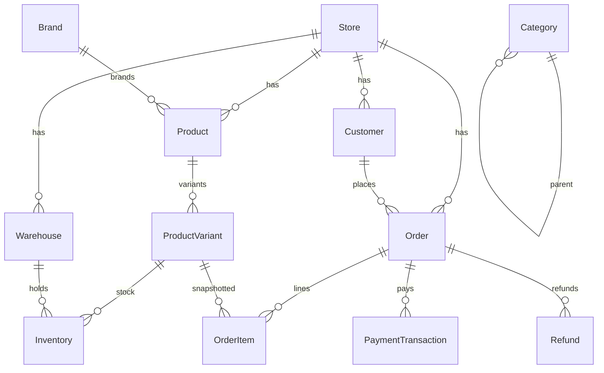

# Database Design

PostgreSQL via Prisma. CRM models removed; auth/RBAC retained; e-commerce domain added.

## Principles

1. Never use floating point for money — `Decimal(15, 4)`
2. Never store files in PostgreSQL — `MediaAsset` metadata only
3. Never mutate historical order pricing — snapshot on `OrderItem`
4. Transactions for financial / inventory operations
5. Soft delete (`deletedAt`) on catalog/customers; hard rules on ledgers
6. `storeId` on all tenant-scoped entities (multi-store ready)
7. UUID primary keys; snake_case `@@map` tables

## Entity groups

```text
Auth & RBAC     User, Role, Permission, Session, RefreshToken, AuditLog, ...
Store           Store, StoreSettings, Currency, TaxRegion, TaxClass, TaxRate
Catalog         Product, ProductVariant, Brand, Category, Collection, Tag, Media
Inventory       Warehouse, Inventory, InventoryMovement, Reservation, PO, Supplier
Customers       Customer, CustomerAddress, CustomerGroup
Sales           Cart, Order, OrderItem, Fulfillment, Shipment
Payments        PaymentTransaction, Refund, PaymentWebhookEvent
Shipping        ShippingZone, ShippingMethod, ShippingRate
Marketing       Promotion, Coupon, GiftCard, StoreCredit (+ ledgers)
CMS             CmsPage, CmsBanner, CmsMenu, MediaAsset
CX              Review, Wishlist, Notification, NotificationTemplate
Ops             ReportJob, IdempotencyKey
```

## Core ERD



## Indexing strategy

| Pattern | Example |
|---------|---------|
| Tenant + status | `(store_id, status)` on products, orders |
| Unique business keys | `(store_id, sku)`, `order_number` |
| Inventory uniqueness | `(warehouse_id, variant_id)` |
| Time-series lists | `(customer_id, created_at)`, `(store_id, created_at)` |
| Search | GIN/trigram later; initial `ILIKE` + indexes on `name`, `sku`, `barcode` |
| Soft delete | Partial indexes `WHERE deleted_at IS NULL` where useful |

## Migration strategy

- Active migrations: `prisma/migrations/` (e-commerce baseline only)
- Baseline: `prisma/migrations/20260811120000_ecommerce_baseline/`
- Dev/staging may reset; production requires planned cutover once live data exists
